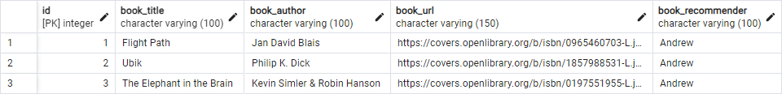

# 🔐 jsExprOauthDb


A Node.js + Express web application demonstrating full-stack database integration with local and Google OAuth authentication strategies via Passport.js. This capstone project was completed for Angela Yu’s [Web Development Bootcamp](https://www.udemy.com/course/the-complete-web-development-bootcamp/), combining earlier CRUD/database lessons with more advanced authentication topics.

---

## 📚 Table of Contents

-   [November 2024 Changes](#-november-2024-changes)
-   [Project Structure](#-project-structure)
-   [Installation](#-installation--getting-started)
-   [Database Setup](#-database-setup)
-   [Development Process](#-development-process)
-   [Thoughts & Reflections](#-thoughts--reflections)
-   [Author](#-andrew-blais)

---

## 🗓 November 2024 Changes

-   Project renamed from `jsCapstoneBook` → `jsExprOauthDb` for clarity
-   Added Passport strategies:
    -   `passport-local`
    -   `passport-google-oauth20`
-   Notes on authentication are documented in [`./docs/notesOnOauth.ipynb`](./docs/notesOnOauth.ipynb)

---

## 🗂 Project Structure

```

jsExprOauthDb
├───public/
│ ├───assets/icons/
│ ├───images/
│ ├───js/
│ └───styles/
├───views/
│ ├───partials/
│ ├───books.ejs
│ ├───login.ejs
│ └───register.ejs
├───.env
├───.gitignore
├───index.js
├───LICENSE
├───package.json
├───package-lock.json
└───README.md

```

---

## ⚙️ Installation / Getting Started

### 1. Prerequisites

-   [Node.js](https://nodejs.org/)
-   [PostgreSQL](https://www.postgresql.org/)
-   [pgAdmin 4](https://www.pgadmin.org/)
-   Terminal with Bash or Git Bash

### 2. Install Node and Required Packages

```bash
npm init -y
npm install
npm install pg express body-parser ejs dotenv passport passport-local passport-google-oauth20
```

Also add this to your `package.json`:

```json
"type": "module"
```

---

## 🛢 Database Setup

Use pgAdmin to create a new database:

-   Name: `js_capstone_book`

Then run this SQL via the Query Tool:

```sql
CREATE TABLE book_recommendations (
  id SERIAL PRIMARY KEY,
  book_title VARCHAR(100) NOT NULL,
  book_author VARCHAR(100),
  book_url VARCHAR(150),
  book_recommender VARCHAR(100),
  book_comments VARCHAR(1000),
  date_added VARCHAR(15),
  date_updated VARCHAR(15)
);
```

Insert starter rows:

```sql
INSERT INTO book_recommendations (book_title, book_author, book_url, book_recommender)
VALUES
  ('Flight Path', 'Jan David Blais', 'https://covers.openlibrary.org/b/isbn/0965460703-L.jpg', 'Andrew'),
  ('Ubik', 'Philip K. Dick', 'https://covers.openlibrary.org/b/isbn/1857988531-L.jpg', 'Andrew'),
  ('The Elephant in the Brain', 'Kevin Simler & Robin Hanson', 'https://covers.openlibrary.org/b/isbn/0197551955-L.jpg', 'Andrew');
```

📸 Table preview:



---

## 🛠 Development Process

### 1. Design & Frontend

-   Handcrafted EJS views using original HTML & CSS
-   Responsive layout with flex containers
-   Custom favicon designed in GIMP


---

### 2. Backend Integration

-   First tested frontend functionality using a local JS array
-   Once routing and display were confirmed, transitioned to using PostgreSQL with proper `pg` queries
-   Used `pgAdmin` Query Tool to test raw SQL before translating it into JS

Example JavaScript insert query:

```js
await db.query(
    `INSERT INTO book_recommendations
     (book_title, book_author, book_url, book_recommender, date_added, date_updated, book_comments)
   VALUES ($1, $2, $3, $4, $5, $6, $7)`,
    [
        resultBookData.title,
        resultBookData.author,
        imageURL,
        trimmedRecommender,
        dateAdded,
        dateAdded,
        trimmedBookComments,
    ]
);
```

---

### 3. Authentication (OAuth)

-   Configured Passport.js for both local and Google OAuth 2.0
-   Set up session handling and environment-based credential loading with `dotenv`
-   Login/register flow built using `.ejs` templates

See `notesOnOauth.ipynb` for a detailed breakdown of implementation steps.

---

### 4. Deploying to GitHub

```bash
git init
git add --all
git commit -m "first commit"
git branch -M main
git remote add origin https://github.com/andrewblais/jsExprOauthDb.git
git push -u origin main
```

---

## 💡 Thoughts & Reflections

### What Was Challenging

-   Designing clean, responsive layout with custom styling
-   Naming and structuring form elements across `.ejs` and backend logic
-   Getting familiar with `passport` and the Google OAuth flow
-   Translating SQL logic into secure, parameterized JavaScript queries

### What Was Rewarding

-   Seeing all parts of the app — frontend, backend, database, and auth — work together
-   Building something practical from scratch
-   Strengthening fluency in JavaScript and backend logic

### What I’d Improve

-   DRY out the CSS where possible for scalability
-   Don’t over-perfect during early stages — get working first, refactor later
-   Improve form validation and error feedback for users

---

📸 Final Screenshot


---

_Andrew Blais, Boston, Massachusetts_

📖 Student of full-stack web development, machine learning, and software engineering  
🏠 Boston, Massachusetts  
🔗 [GitHub](https://github.com/andrewblais) | [Portfolio](https://andrewblais.dev)
